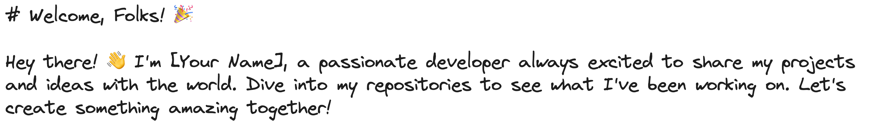
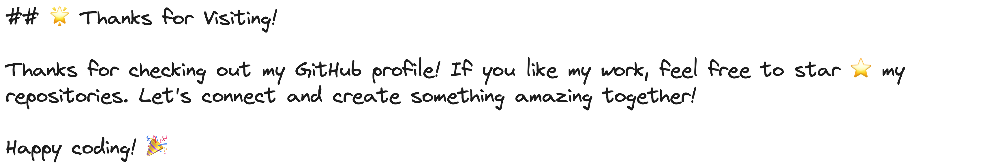

###### **A bit about myself: **

I'm a Software Engineer at Juntrax, where we build HR and professional service automation solutions for startups and MSMEs worldwide.

I love working with startups, especially in health tech, food, and retail sectors. I've led projects that drive growth and streamline operations, generating recurring revenue and improving workflows.

I thrive in collaborative environments and am passionate about creating user-centered products.

📌 **Infrastructure & Operations** - GitHub, Jira, Bitbucket, Docker, Google Cloud Platform  
📌 **Logic & Storage** - Node.js, Express, Cloud Functions, MongoDB, Firebase, MySQL  
📌 **Visual Delivery** - React, Flutter, Redux, HTML5, CSS, Tailwind, Material Design, Bootstrap  
📌 **Documentation** - Confluence, Postman, Draw.io

###### **My favorite quote:**

> The goal is not simply for you to cross the finish line, but to see how many people you can inspire to run with you.

###### **CONNECT WITH ME**

