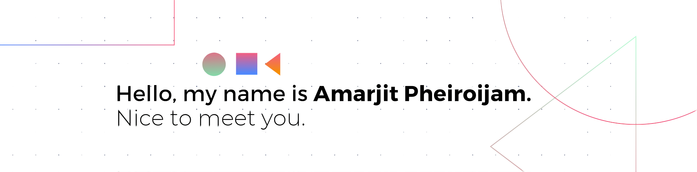

###### **A bit about myself (\***duped from my Linkedin profile**\*):**

I'm software engineer currently working at @Addble ,A business management startup dealing with software such as GST Billing, and POS for Retail, Wholesales, Cafes & Restaurants. 

I have a proven records in delivering multiple end to end software products with startups, which results in operation expansions and hiring more people in a health technology space, I have delivered a project which bring recurring revenue from medium to large restaurants in my current position and worked with multiple features which improve workflow and onboarding restaurants into the platform. I have also worked with multiple startups including Health-tech, food & Retails etc. I worked closely with founders and seniors with huge experience in the software industry within a small startup team.

I always have a creative approach to every problem which enhances my problem-solving skills, and I'm also a team player with hands-on experience in different levels of design and development of data-driven software products, I'm really passionate about developing products that empower people with great users empathy.

##### [Certified with StartUp India Program by Government of India - Invest India.](https://www.credential.net/cbb4d9c9-0b3d-44a0-b134-cac16e7074c7#gs.p5gscc) 

📌DevOps - Github, Jira, Bitbucket, Docker, Google Cloud Platform 
📌Back‑end - Nodejs, Express, Cloud functions, MongoDB, Firebase, MySql, REST API 
📌Front‑end - React, Flutter, Redux, HTML5, CSS, Tailwind, Material Design, Bootstrap 
📌Programming Langauge - C++, Javascript, Typescript, Dart 
📌Documentation - Confluence, Postman, Draw.io 

###### **My favorite quote:**

> The goal is not simply for you to cross the finish line, but to see how many people you can inspire to run with you.

###### **CONNECT WITH ME**

