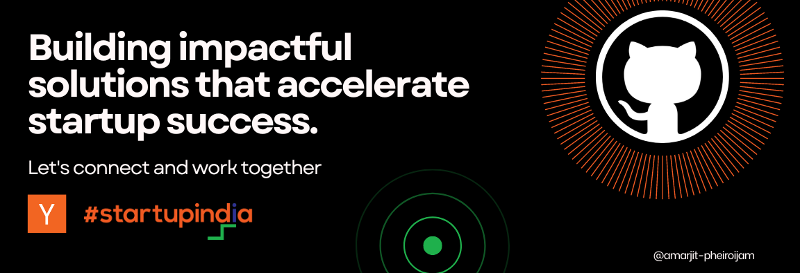
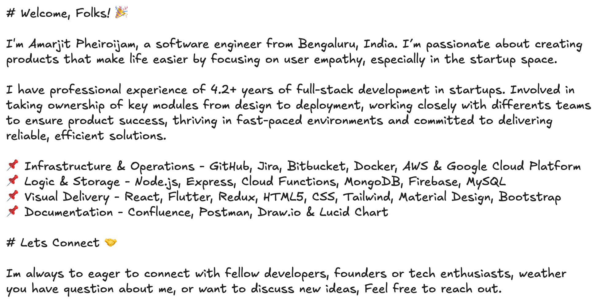

<!-- Dark/Light Mode Support -->
<picture>
  <!-- Dark mode image -->
  <source media="(prefers-color-scheme: dark)" srcset="./resources/img/profile-description-dark.png">
  
  <!-- Light mode image -->
  <source media="(prefers-color-scheme: light)" srcset="./resources/img/profile-description-light.png">
  
  <!-- Fallback image -->
  
</picture>

<!-- You found something more about me.

< My favorite quote > 
The goal is not simply for you to cross the finish line, but to see how many people you can inspire to run with you.

NO.1 PRINCIPLE OF MY LIFE
Live for the people you love and around you, and make the money pile for them.

!--->

 </a>
