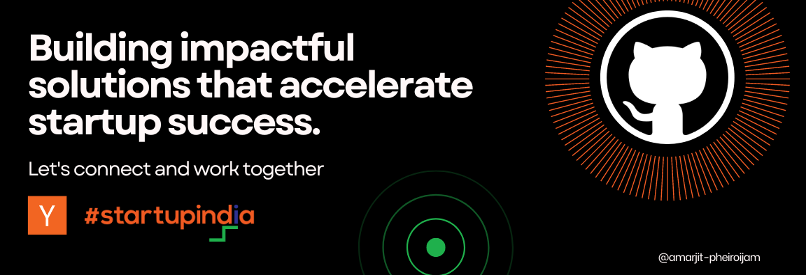

I have professional experience of 4.2+ years of full‐stack development in startups. Involved in taking ownership of key modules from design to deployment, working closely with differents teams to ensure product success. Comfortable in fast‐paced environments and committed to delivering reliable, effective solutions.

 

📌 **Infrastructure & Operations** - GitHub, Jira, Bitbucket, Docker, AWS & Google Cloud Platform  
📌 **Logic & Storage** - Node.js, Express, Cloud Functions, MongoDB, Firebase, MySQL  
📌 **Visual Delivery** - React, Flutter, Redux, HTML5, CSS, Tailwind, Material Design, Bootstrap  
📌 **Documentation** - Confluence, Postman, Draw.io & Lucid Chart

 

</a>

###### **My favorite quote:**
> The goal is not simply for you to cross the finish line, but to see how many people you can inspire to run with you.

